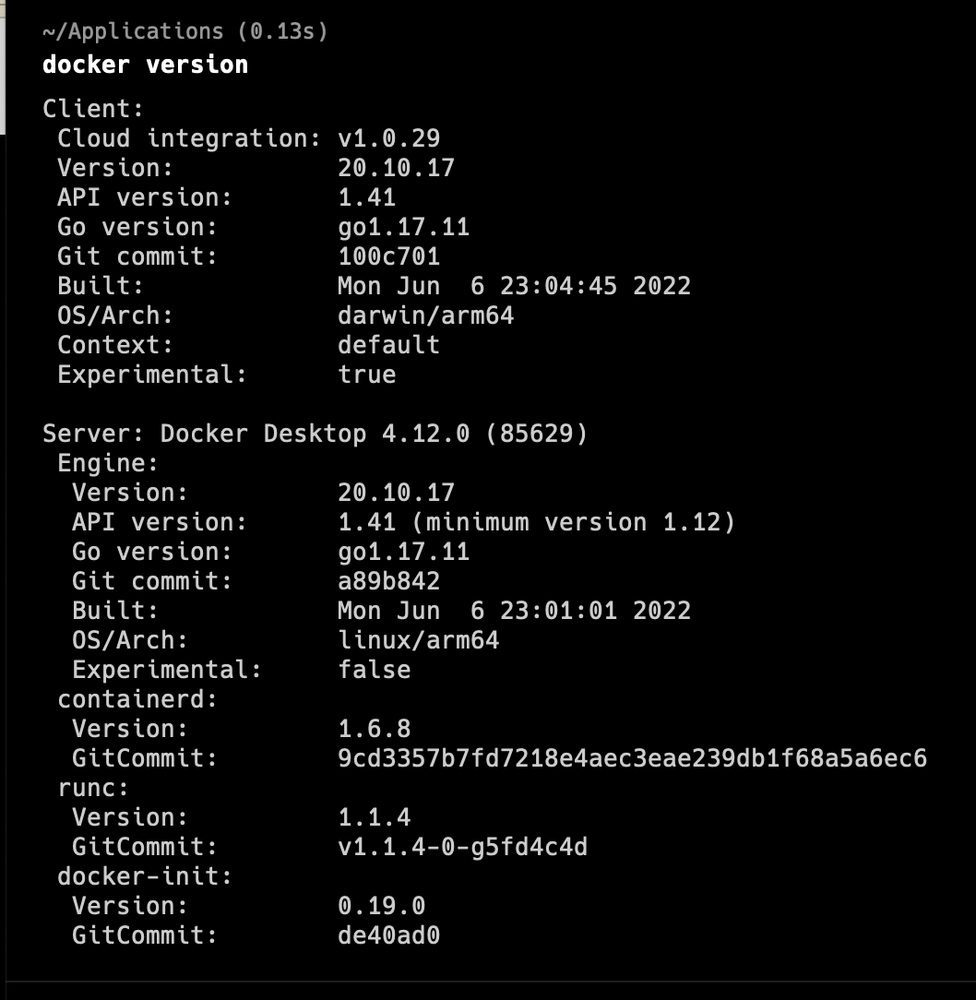
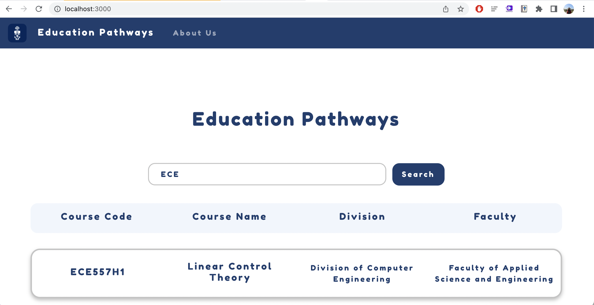
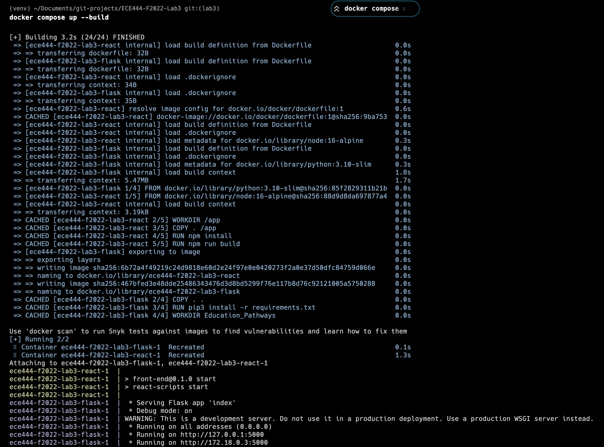

# My My Tran
This repo is copied from https://github.com/ECE444-2022Fall/Assignment_1_starter_template/tree/docker-prep. 

# Lab 3: Education Pathway

This is a modified version of the previous Assignment1 template.

The deploye version can be found at https://lab3-docker.herokuapp.com.

This project was bootstrapped with [Create React App](https://github.com/facebook/create-react-app) for frontend, and [Flask-tdd](https://github.com/mjhea0/flaskr-tdd) for backend.

## Activity 1: Create the lab3 branch and pull the code

## Activity 2: Docker Installation
1. Follow the instructions in https://docs.docker.com/get-docker/ to install Docker.

## Activity 3: Getting things ready locally
Follow the instructions in the README file on docker-prep branch to run the code locally.
Add a screenshot of the application running locally. Remember to include the address bar showing that it is running locally.

## Activity 4: Building and running the docker image locally
1.	Build and run docker images with the Docker using the command “docker compose up --build”.
2.	Add a screenshot of the log for the above command to your README file on the “lab3” branch. E.g.

### Things learned:
* when running locally, run in virtual environment via `python3 -m venv venv` + `. venv/bin/activate`